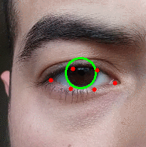

# computer_vision
##Eye State Prediction  
Computer vision is an interdisciplinary scientific field that deals with how computers can be made to gain high-level understanding from digital images or videos. From the perspective of engineering, it seeks to automate tasks that the human visual system can do.  *-from wikipedia.org*

